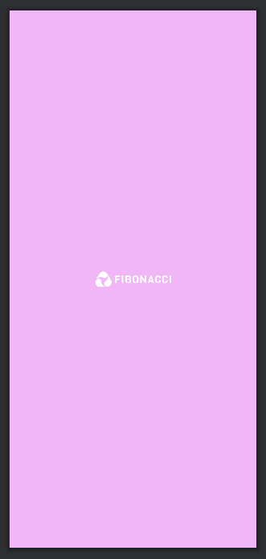
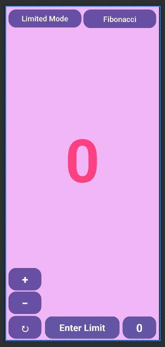

# Fibonacci_App


```
Nama    : Dipca Anugrah
NIM     : 312210666
Kelas   : TI.22.A.4
Matkul  : Pemrograman Mobile 1
Dosen   : Donny Maulana, S.Kom., M.M.S.I.
```

## **Daftar Isi**

**[Tentang Aplikasi](#tentang-aplikasi)**  
**[Desain Aplikasi](#desain-aplikasi)**  
**[Fitur-Fitur Aplikasi](#fitur-fitur-aplikasi)**  
**[Penjelasan Kode Program](#penjelasan-kode-program)**  
**[Demo Aplikasi](#demo-aplikasi)**

## **Tentang Aplikasi**

Ini adalah aplikasi untuk menghitung bilangan Fibonacci yaitu pola bilangan hasil penjumlahan dua bilangan sebelumnya. Contoh polanya 0,1,1,2,3,5,8,13 dan seterusnya, 2 hasil dari (1+1).

## **Desain Aplikasi**

 

## **FItur-Fitur Aplikasi**

**1. Mode Perhitungan**  
Terdapat 2 Mode pada aplikasi fibonacci tersebut yakni:

- Limited-Mode : harus memasukkan limit/batas terlebih dahulu baru bisa melakukan perhitungan.
- Unlimited-Mode : tanpa harus memasukkan limit/batas untuk melakukan perhitungan.

**2. Limit/Batas Perhitungan**  
Arti limit/Batas disini adalah User bisa membatasi perhitungan fibonacci dibaris keberapa contoh user menginputkan 12 maka perhitungan fibonacci akan berhenti pada nilai 144 karna nilai 144 adalah baris ke-12 dalam perhitungan fibonacci.

**3. Perhitungan Naik (Count Up) dan Perhitungan Turun (Count Down)**  
Yaitu perhitungan bisa dilakukan naik (Count Up) dan Perhitungan bisa dilakukan menurun (Count Down), maksudnya adalah pada saat user melakukan perhitungan naik smpai nilai 21 daln jika user melakukan perhitungan turun sekali maka akan mundur satu baris, nilainya menjadi 13 karna nilai sebelum 21 adalah 13.

**4. Reset**  
Yaitu semua nilai terkait Fibonacci diatur kembali ke nilai awal, dan tampilan diperbarui.

**5. Tampilan Baris Fibonacii**  
Yaitu menampilkan baris berapa dalam perhitungan fibonacci saat ini.

## **Penjelasan Kode Program**

### **MainActivity.java**

**1. onCreate(Bundle savedInstanceState):**

```java
protected void onCreate(Bundle savedInstanceState) {
        super.onCreate(savedInstanceState);
        setContentView(R.layout.activity_main);
        mShowFibonacci = (TextView) findViewById(R.id.show_count);
        mLimitInput = (EditText) findViewById(R.id.limit_input);
        updateFibonacciDisplay();
    }
```

- Fungsi ini dipanggil saat aktivitas dibuat. Di sini, layout dari `activity_main.xml` diatur sebagai tata letak utama.
- TextView `mShowFibonacci` dan EditText `mLimitInput` diinisialisasi dengan elemen yang sesuai dari layout.
- `updateFibonacciDisplay()` dipanggil untuk menginisialisasi tampilan Fibonacci awal.

**2. countUp(View view):**

```java
public void countUp(View view) {
        if (limitRequiredMode) {
            if (mLimitInput.getText().toString().isEmpty()) {
                Toast.makeText(this, "Enter the limit first", Toast.LENGTH_SHORT).show();
                return;
            }
            limit = Long.parseLong(mLimitInput.getText().toString());
            if (n >= limit) {
                Toast.makeText(this, "Fibonacci limit reached", Toast.LENGTH_SHORT).show();
                return; // Hentikan perhitungan jika jumlah baris Fibonacci mencapai batas
            }
            long newFib = fibMinus1 + fibMinus2;
            fibMinus2 = fibMinus1;
            fibMinus1 = newFib;
            currentFib = newFib;
            n++; // Inkrementasi jumlah baris Fibonacci
            updateFibonacciDisplay();
            updateNDisplay();
        }

        if (!limitRequiredMode) {
            long newFib = fibMinus1 + fibMinus2;
            fibMinus2 = fibMinus1;
            fibMinus1 = newFib;
            currentFib = newFib;
            n++;
            updateFibonacciDisplay();
            updateNDisplay();
        }

    }
```

- Fungsi ini dipanggil ketika tombol "Count Up" ditekan.
- Jika aplikasi berada dalam mode batas (limitRequiredMode), fungsi akan memeriksa apakah batas Fibonacci telah tercapai atau tidak. Jika tidak, nilai Fibonacci akan dihitung dan ditampilkan.
- Jika aplikasi tidak dalam mode batas, nilai Fibonacci akan dihitung dan ditampilkan tanpa memeriksa batas.

**3. countDown(View view):**

```java
public void countDown(View view) {

        if (currentFib == 0) {
            Toast.makeText(this, "Fibonacci limit reached", Toast.LENGTH_SHORT).show();
            return; // Hentikan perhitungan jika jumlah baris Fibonacci mencapai batas
        }
        long temp = fibMinus2;
        fibMinus2 = fibMinus1 - fibMinus2;
        fibMinus1 = temp;
        currentFib = fibMinus1;
        n--;
        updateFibonacciDisplay();
        updateNDisplay();
    }
```

- Fungsi ini dipanggil ketika tombol "Count Down" ditekan.
- Jika nilai Fibonacci saat ini adalah 0, pesan kesalahan akan ditampilkan. Jika tidak, nilai Fibonacci akan dikurangi, dan tampilan diperbarui.

**4. toggleMode(View view):**

```java
public void toggleMode(View view) {
        Button toggleButton = (Button) view;
        limitRequiredMode = !limitRequiredMode;
        mLimitInput.setEnabled(limitRequiredMode); // Menonaktifkan input saat dalam mode "no-limit"
        if (limitRequiredMode) {
            mLimitInput.setVisibility(View.VISIBLE);
            toggleButton.setText("Limited Mode");
            mLimitInput.setHint("Enter Limit");
            currentFib = 0;
            fibMinus2 = 1;
            fibMinus1 = 0;
            limit = 0;
            n = 0;
            mLimitInput.setText(""); // Mengosongkan input
            updateFibonacciDisplay();
            updateNDisplay();
        } else {
            mLimitInput.setVisibility(View.VISIBLE);
            toggleButton.setText("Unlimited Mode");
            mLimitInput.setHint("Unlimited");
            currentFib = 0;
            fibMinus2 = 1;
            fibMinus1 = 0;
            limit = 0;
            n = 0;
            mLimitInput.setText(""); // Mengosongkan input
            updateFibonacciDisplay();
            updateNDisplay();
        }
    }
```

- Fungsi ini dipanggil ketika tombol "Toggle Mode" ditekan.
- Mode batas (`limitRequiredMode`) akan diubah. Jika berada dalam mode batas, tombol diubah menjadi "Limited Mode" dan EditText `mLimitInput` disertakan. Jika tidak, tombol diubah menjadi "Unlimited Mode" dan EditText disembunyikan.

**5. reset(View view):**

```java
public void reset(View view) {
        currentFib = 0;
        fibMinus2 = 1;
        fibMinus1 = 0;
        limit = 0;
        n = 0;
        mLimitInput.setText("");// Mengosongkan input

        updateFibonacciDisplay();
        updateNDisplay();
    }
```

- Fungsi ini dipanggil ketika tombol "Reset" ditekan.
- Semua nilai terkait Fibonacci diatur kembali ke nilai awal, dan tampilan diperbarui.

**6. updateFibonacciDisplay():**

```java
 private void updateFibonacciDisplay() {
        if (mShowFibonacci != null) {
            mShowFibonacci.setText(Long.toString(currentFib));
            mShowFibonacci.setTextColor(getFibonacciColor());
        }
    }
```

- Fungsi ini mengupdate tampilan TextView `mShowFibonacci` dengan nilai Fibonacci saat ini dan mengatur warna teks berdasarkan nilai tersebut.

**7. updateNDisplay():**

```java
private void updateNDisplay() {
        TextView nTextView = findViewById(R.id.show_n);
        if (nTextView != null) {
            nTextView.setText(String.valueOf(n));
        }
    }
```

- Fungsi ini mengupdate tampilan TextView `nTextView` dengan nilai n saat ini.

**8. showFibonacci(View view):**

```java
public void showFibonacci(View view) {
        Toast toast = Toast.makeText(this, R.string.fibonacci_message, Toast.LENGTH_SHORT);
        toast.show();
    }
```

- Fungsi ini dipanggil ketika tombol "Show Fibonacci" ditekan.
- Menampilkan pesan Toast yang berisi pesan dari sumber daya string (`R.string.fibonacci_message`).

**9. getFibonacciColor():**

```java
private int getFibonacciColor() {
        // Gantilah warna berdasarkan nilai Fibonacci
        i++;
        if (i % 2 == 0) {
            return ContextCompat.getColor(this, R.color.colorFibonacciPinkDark);
        } else {
            return ContextCompat.getColor(this, R.color.white);
        }
    }
```

- Fungsi ini mengembalikan warna berdasarkan nilai Fibonacci. Warna diubah berdasarkan nilai `i` untuk menciptakan efek visual.

### **SplashScreen.java**

**1. onCreate(Bundle savedInstanceState):**

```java
    protected void onCreate(Bundle savedInstanceState){
        getWindow().setFlags(WindowManager.LayoutParams.FLAG_FULLSCREEN, WindowManager.LayoutParams.FLAG_FULLSCREEN);

        super.onCreate(savedInstanceState);
        setContentView(R.layout.splash_screen);
        new Handler().postDelayed(new Runnable() {
            @Override
            public void run() {
                startActivity(new Intent(SplashScreen.this, MainActivity.class));
                finish();
            }
        }, 6000);
    }
```

- Fungsi ini dipanggil saat aktivitas `SplashScreen` dibuat.
- Kode `getWindow().setFlags(...)` digunakan untuk menghilangkan status bar dan membuat aktivitas tampil dalam mode layar penuh.
- Layout dari `splash_screen.xml` diatur sebagai tata letak utama menggunakan `setContentView`.
- Objek `Handler` digunakan untuk menunda pengalihan ke aktivitas `MainActivity` selama 6000 milidetik (6 detik) menggunakan metode `postDelayed`.
- Setelah penundaan selesai, aktivitas `MainActivity` dimulai dan aktivitas `SplashScreen` ditutup menggunakan `finish()`.

**2. new Handler().postDelayed(...):**

```java
new Handler().postDelayed(new Runnable() {
            @Override
            public void run(){

            }
```

- Ini adalah implementasi penundaan yang memungkinkan perpindahan ke aktivitas `MainActivity` setelah waktu yang ditentukan.
- `postDelayed` mengizinkan penjadwalan tugas yang akan dijalankan setelah waktu tertentu.

**3. startActivity(new Intent(...)):**

```java
startActivity(new Intent(SplashScreen.this, MainActivity.class));
```

- Digunakan untuk memulai aktivitas baru, yaitu `MainActivity`, setelah waktu penundaan selesai.
- Intent digunakan untuk menyatakan tujuan perpindahan dari `SplashScreen` ke `MainActivity`.

**4. finish():**

```java
  finish();
```

- Digunakan untuk menutup aktivitas `SplashScreen` setelah pengalihan ke `MainActivity` dilakukan.

**5. getWindow().setFlags(...):**

```java
getWindow().setFlags(WindowManager.LayoutParams.FLAG_FULLSCREEN, WindowManager.LayoutParams.FLAG_FULLSCREEN);
```

- Mengatur flag pada jendela aktivitas untuk menghilangkan status bar dan membuat aktivitas tampil dalam mode layar penuh.

## **Demo Aplikasi**


**LINK DEMO ---> [video](https://drive.google.com/file/d/1txIjIMQIJ5ccuee_BCUGCoa63Ev0ulse/view?usp=drive_link)**

<hr>

**[Back-->](#fibonacci_app)**
